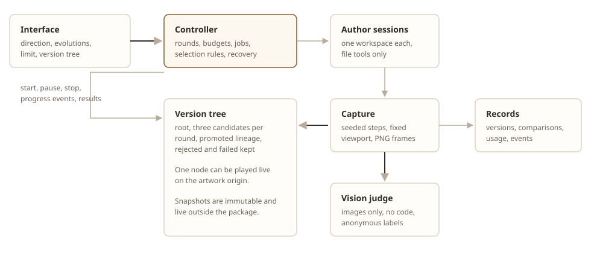

# phygen

Phygen evolves a generative artwork through Pi agents. You select a version, give
a direction, and say how many **variants** (children) each evolution produces
and how many **evolutions** (levels) to run. The winner of each level becomes the
parent of the next one. A vision model compares the rendered images, and the tree
keeps every version. Any version can be played live.



## What is here

| Path | Contents |
| --- | --- |
| `runtime/` | The artwork contract, the schema validator, the strict configuration loader, the manifest rules, and the Node package checks. |
| `threejs/` | The `physarum` artwork package: manifest, configuration schema, simulation, renderer, and the runtime adapter. |
| `server/` | The controller, storage, capture, providers, judge protocol, API, and the separate artwork origin. |
| `web/` | The React, TypeScript, and React Flow interface. |
| `docs/` | The API contract, the capture measurements, and the interface images. |
| `data/`, `snapshots/` | Records, captures, and immutable source snapshots. Not source. |

## Install

```bash
cd server && npm install
cd ../web && npm install
```

## Run

```bash
cd server && npm start
```

Then open <http://127.0.0.1:8787/>. The controller serves the interface on 8787
and the artwork on 8788. The artwork origin has no API and no credentials, and
it is kept separate on purpose.

## Test

```bash
cd server && npm test      # controller, budget, judge, and one full round
cd threejs && npm test     # artwork package: seeds, reset, bounds, adapter
cd threejs && npm run validate
```

## Settings

| Variable | Default | Effect |
| --- | --- | --- |
| `PHYGEN_ALLOW_SPEND` | unset | Model calls are refused until you set this to `1`. |
| `PHYGEN_DRIVER` | `auto` | `pi` uses the Pi sessions. `fake` uses the deterministic test double. |
| `PHYGEN_MODEL` | `moonshotai/kimi-k3` | The judge model. |
| `PHYGEN_AUTHOR_MODEL` | same as `PHYGEN_MODEL` | The author model. |
| `PHYGEN_VARIANTS` | `3` | Default children per evolution. |
| `PHYGEN_MAX_RUN_USD` | `0` | A cost limit. `0` enforces none. |
| `PHYGEN_COST_SAFETY_FACTOR` | `1.8` | The estimate is multiplied by this for the record. |
| `PHYGEN_REQUIRE_ISOLATION` | `0` | Set to `1` to refuse source-code variants without a container. |
| `PHYGEN_CAPTURE` | `auto` | `local`, `docker`, or `auto`. |
| `PHYGEN_PORT`, `PHYGEN_LIVE_PORT` | `8787`, `8788` | The two listeners. |

Cost estimates use the live Kilo catalog prices and an estimated token count.
Provider usage is authoritative. No cost guardrail is enforced by default: the
record keeps the real spend, and a run is never stopped or refused for money.
Set `PHYGEN_MAX_RUN_USD` if you want a limit.

## Boundaries

Generated and imported code is untrusted. Candidates run in the artwork page on
a separate origin with a strict content policy, no credentials, no network, and
no host directory access. A container boundary is stronger and is available
through `PHYGEN_CAPTURE=docker`; without it, set `PHYGEN_REQUIRE_ISOLATION=1` and
the controller refuses source-code candidates. Judges receive images only: no
source, no author claim, and no tools.

The API has no authentication and no CSRF control. Keep it on the loopback
address until that work is done.
